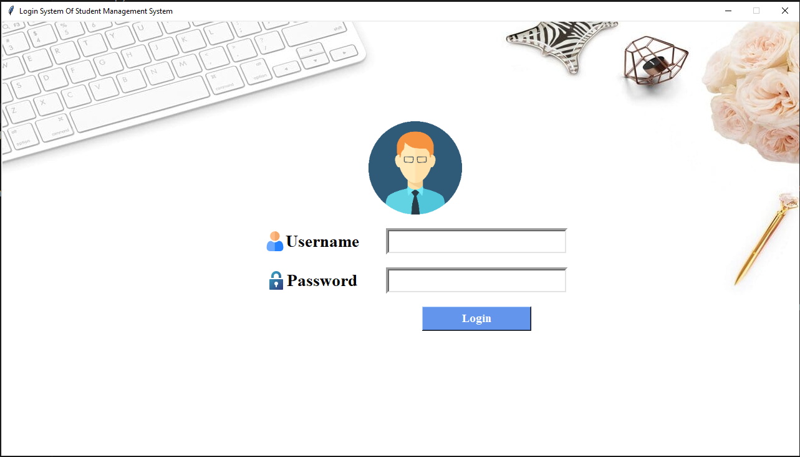

# Student Registration System using Tkinter, OpenPyXL & Pillow

Welcome to the **Student Registration System**, a Python GUI-based application developed using **Tkinter** for the interface, **OpenPyXL** for Excel file integration, and **Pillow** for image handling. This project demonstrates how to create a fully functional data-entry system for students that is both beginner-friendly and professionally structured.

---

## 🔍 Overview

The Student Registration System allows users to input student information, capture and store their image, and save all data into an Excel file with a single click. Designed as a desktop application, it runs on any system with Python installed. Screenshots are included to provide a clear visual guide on using the application.

---

## 🚀 Features

* 🎨 **User Interface with Tkinter**: Clean, interactive, and responsive GUI.
* 📷 **Image Upload Functionality**: Upload and store student photos using the Pillow library.
* 📊 **Excel File Integration**: Automatically store student records into an Excel file using OpenPyXL.
* 📂 **Dynamic Directory Management**: Automatically creates required folders and files if they don’t exist.
* 🔁 **Reset Function**: Clear the form fields for new data entry.
* 💾 **Save Button**: Validates input and saves the data securely.
* 🖼️ **Screenshots Included**: Preview the app and understand its flow visually.

---

## 🧠 Learning Highlights

This project demonstrates the integration of multiple Python libraries to build a practical software application. You will learn:

* GUI Design with Tkinter
* Handling images using Pillow
* Writing and updating Excel files using OpenPyXL
* Organizing project files and creating reusable code
* Building user-friendly forms

---

## 🗃️ File Structure

```
📁 Student-Registration-System
├── student_register.py           # Main application file
├── Student_data.xlsx             # Auto-created Excel file
├── Students Images/              # Folder for student photos
├── README.md                     # Project description
├── screenshots/                  # Contains screenshots of the GUI
│   └── front_page.png            # Screenshot of the front page UI
```

> ⚠️ Note: `Student_data.xlsx` and the `Students Images/` folder are created automatically when the program is run for the first time.

---

## ⚙️ Requirements

Install dependencies using pip:

```
pip install pillow openpyxl
```

---

## ▶️ How to Run

1. Clone this repository:

   ```bash
   git clone https://github.com/mian-arham-haroon/student-registration-system.git
   ```
2. Install dependencies:

   ```bash
   pip install pillow openpyxl
   ```
3. Run the application:

   ```bash
   python student_register.py
   ```

---

## 🖼️ Screenshots

Screenshots are available in the `/screenshots` folder to help you visually understand how the system works and what it looks like. Below is a snapshot of the application's front page:




---

## 💡 Optional Enhancements

* Add database support using SQLite or MySQL
* Implement data validation for better input control
* Add search & edit functionality for existing records
* Export records to PDF using ReportLab or FPDF

---

## 📌 Conclusion

This project is an excellent starting point for beginners looking to understand GUI programming in Python and handling real-world data with files and images. Feel free to explore the code, test the features, and improve it further!
